# AI Database Design

This document details the database models added to A-Collab for the Enterprise AI Collaboration System.

## 📊 ER Diagram

```mermaid
erDiagram
    Workspace ||--o{ AIConversation : hosts
    AIConversation ||--o{ AIMessage : contains
    Workspace ||--o{ WorkspaceMemory : remembers
    Workspace ||--o{ WorkspaceKnowledge : indexes
    Workspace ||--o{ PromptTemplate : configures
    Workspace ||--o{ AIPermission : defines
    Workspace ||--o{ AIAuditLog : logs
    Workspace ||--o{ WorkspaceAIConfig : configures
    Workspace ||--o{ WorkspaceAIPersona : defines
    Workspace ||--o{ AICache : caches
    Workspace ||--o{ AIJob : queues

    AIConversation {
        string id PK
        string workspaceId FK
        string createdBy FK
        string title
        datetime createdAt
        datetime updatedAt
    }

    AIMessage {
        string id PK
        string conversationId FK
        string role "SYSTEM | USER | ASSISTANT"
        string content
        string parentId FK "Self-relation for Conversation Branching"
        datetime createdAt
    }

    WorkspaceMemory {
        string id PK
        string workspaceId FK
        string key
        string value
        datetime updatedAt
    }

    WorkspaceKnowledge {
        string id PK
        string workspaceId FK
        string category "FAQ | STANDARD | SPRINT_GOALS | DEPLOYMENT"
        string title
        string content
        datetime createdAt
        datetime updatedAt
    }

    PromptTemplate {
        string id PK
        string workspaceId FK "NULL if global template"
        string title
        string prompt
        string category
        datetime createdAt
    }

    AIPermission {
        string id PK
        string workspaceId FK
        string toolName "createTask | createDocument | searchMessages"
        boolean isAllowed
    }

    AIAuditLog {
        string id PK
        string workspaceId FK
        string actorId FK
        string prompt
        string agentType "GENERAL | TASK | DOCS"
        string toolUsed
        string toolResult
        string modelUsed
        int promptTokens
        int completionTokens
        int latencyMs
        decimal estimatedCostUsd
        datetime createdAt
    }

    WorkspaceAIConfig {
        string id PK
        string workspaceId FK
        string preferredModel "gemini-2.5-flash | gpt-4o"
        float temperature
        int maxTokens
        string baseSystemPrompt
    }

    WorkspaceAIPersona {
        string id PK
        string workspaceId FK
        string name
        string behavior "HELPFUL | STRICT | TECHNICAL | CREATIVE"
    }

    AICache {
        string id PK
        string workspaceId FK
        string queryHash
        string responseText
        datetime expiresAt
    }

    AIJob {
        string id PK
        string workspaceId FK
        string jobType "DAILY_SUMMARY | WEEKLY_REPORT | BULK_TASK_CREATION"
        string status "PENDING | PROCESSING | COMPLETED | FAILED"
        string payload
        string result
        datetime runAt
        datetime createdAt
    }
```

## Schema Specifications

### WorkspaceAIConfig (Model Settings)
Allows workspaces to customize model parameters.
- `id` (UUID, PK)
- `workspaceId` (UUID, FK → Workspace, Unique)
- `preferredModel` (String, default "gemini-2.5-flash")
- `temperature` (Float, default 0.7)
- `maxTokens` (Int, default 2048)
- `baseSystemPrompt` (Text, optional)

### WorkspaceAIPersona (Assistant Personas)
Modifies the AI's tone of voice.
- `id` (UUID, PK)
- `workspaceId` (UUID, FK → Workspace, Unique)
- `name` (String, default "CollabBot")
- `behavior` (Enum: `HELPFUL`, `STRICT`, `TECHNICAL`, `CREATIVE`)

### AICache (Performance & Cost Saving)
Caches answers to avoid redundant LLM calls.
- `id` (UUID, PK)
- `workspaceId` (UUID, FK)
- `queryHash` (String) - SHA256 of the prompt context + ranking parameters.
- `responseText` (Text)
- `expiresAt` (DateTime)
- `@@unique([workspaceId, queryHash])`

### AIJob (Queue Worker State)
Enables asynchronous job execution.
- `id` (UUID, PK)
- `workspaceId` (UUID, FK)
- `jobType` (String) - e.g. "DAILY_SUMMARY"
- `status` (Enum: `PENDING`, `PROCESSING`, `COMPLETED`, `FAILED`)
- `payload` (Json)
- `result` (Text, optional)
- `runAt` (DateTime) - scheduled run time.
- `createdAt` (DateTime)

### AIAuditLog (Cost Tracking Updates)
Expanded to track exact token expenditures.
- `id` (UUID, PK)
- `workspaceId` (UUID, FK)
- `actorId` (UUID, FK)
- `prompt` (Text)
- `agentType` (String)
- `toolUsed` (String, optional)
- `toolResult` (Text, optional)
- `modelUsed` (String)
- `promptTokens` (Int)
- `completionTokens` (Int)
- `latencyMs` (Int)
- `estimatedCostUsd` (Decimal)
- `createdAt` (DateTime)
