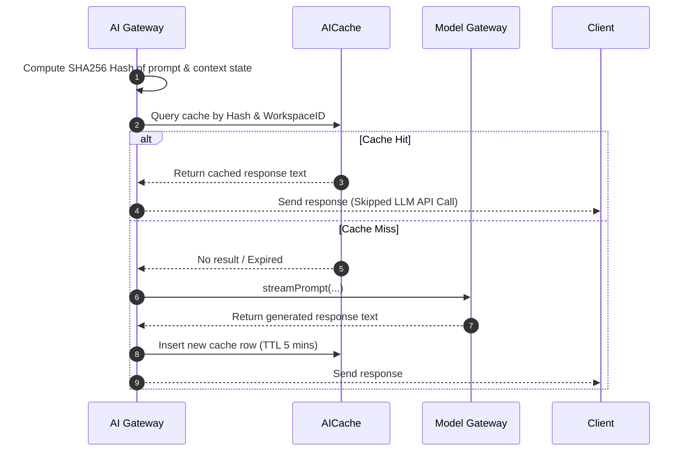
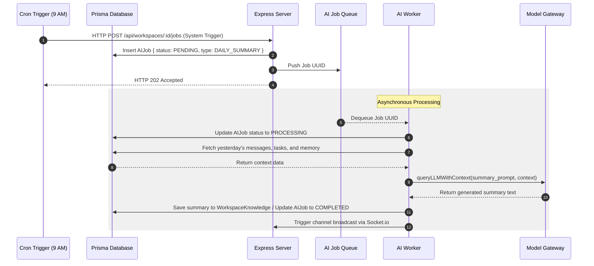

# AI Sequence Diagrams

This document contains sequence flows for the primary AI functionalities.

## 1. AI Caching Sequence

---

## 2. Asynchronous AI Job Worker Sequence

This diagram maps how heavy summaries (e.g. Daily Workspace Summaries) are queued and processed.

