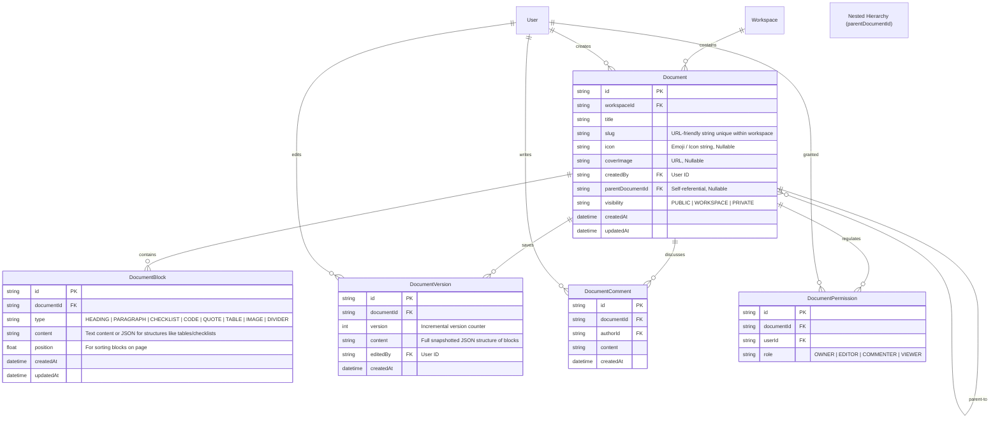

# Document System ER Diagram

This document defines the database design for the Notion-style collaborative Document System, content blocks, versions, page comments, and permissions.

---

## 📊 ER Diagram

---

## 🗄️ Database Design Highlights

1. **Document Hierarchy (Self-Relation)**:
   - The `parentDocumentId` field references the `Document` table itself. This enables unlimited nesting of pages (sub-pages, folders, books), matching Notion's structure.

2. **Block-Based Content System**:
   - Rather than storing content as a single blob of HTML or Markdown, pages are split into individual `DocumentBlock` records. This allows granular page edits, real-time block-level locking, search indexing of specific blocks, and makes the system future-proof for rich interactive components (e.g. embed cards, Kanban-in-doc, etc.).

3. **Incremental Versioning**:
   - The `DocumentVersion` table maintains full snapshot states. Every major revision saves the entire state along with the user ID who saved it, enabling detailed diffs and full document restore capabilities.

4. **Document Permissions (Access Control List)**:
   - Overrides default workspace member roles with granular document-level sharing. It specifies permissions (`OWNER`, `EDITOR`, `COMMENTER`, `VIEWER`) per user for individual documents.
