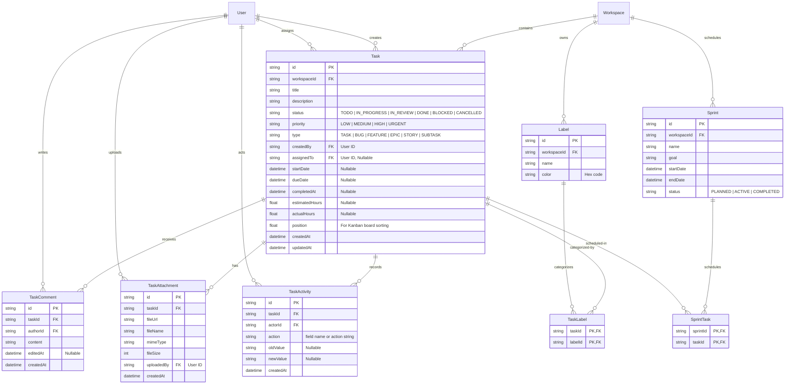

# Task Management ER Diagram

This document describes the database design for the task management, labels, comments, sprints, attachments, and activity history modules.

---

## 📊 ER Diagram

---

## 🗄️ Database Design Highlights

1. **Kanban Ordering (`position`)**:
   - The `position` column uses a floating point number. This allows inserting tasks anywhere on the board (e.g., between position `1.0` and `2.0` by assigning `1.5`) without re-indexing other tasks, enabling high-performance drag-and-drop operations.

2. **Audit & Transparency (`TaskActivity`)**:
   - Every state transition, priority change, and assignee update generates a `TaskActivity` record. This creates an audit log that powers Jira-style activity feeds on the task detail pages.

3. **Many-to-Many Mappings**:
   - `TaskLabel` and `SprintTask` are explicit join tables. This guarantees indexing efficiency and simple migration logic, matching MySQL-specific indexes for fast queries.
